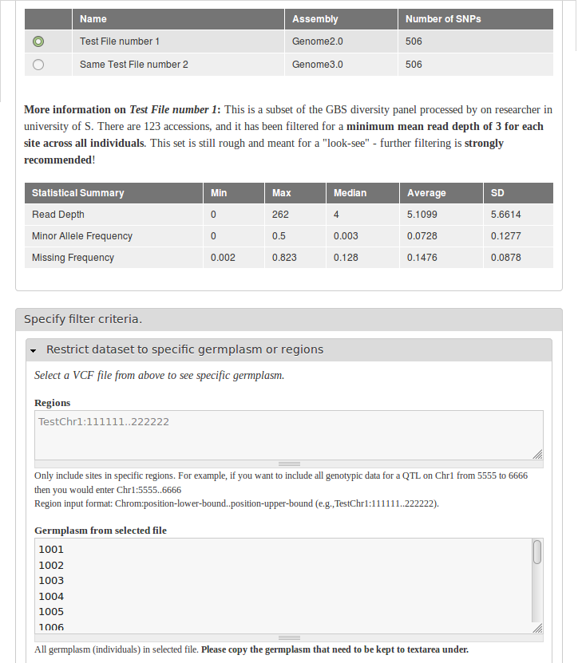

Configuration
=============
The module can be configured in Home » Administration » Tripal » Extensions » VCF Filter by edit a file.

.. toctree::
   :maxdepth: 2
   :caption: In Detail:

   configuration/required_info
   configuration/optional_info
   configuration/test

After configuration, description of one file can be very informative and helpful for filtering options.

