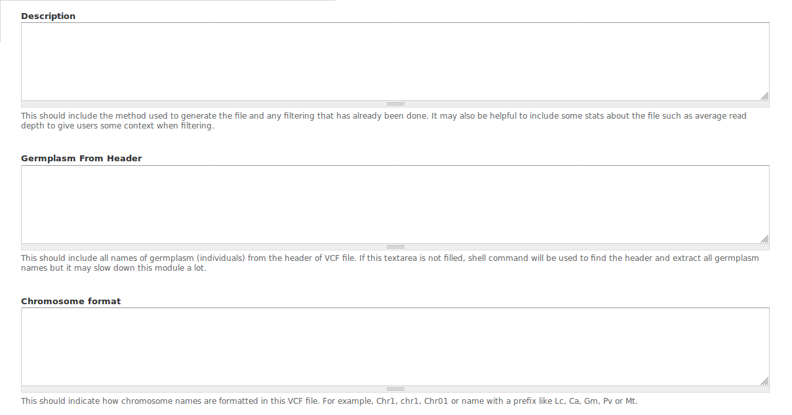

Optinlal information for Adding a file
========================================

Description
-----------

Germplasm From Header
---------------------
The names of all germplasm(individuals) in this vcf file.
FORMAT
If this textarea is not filled, shell command will be used to find the header and extract all germplasm names. However, waiting time of choosing a file can be sifnificant for large files.
Waiting time for a 10G VCF file will be 3 seconds.

Chromosome format
-----------------

