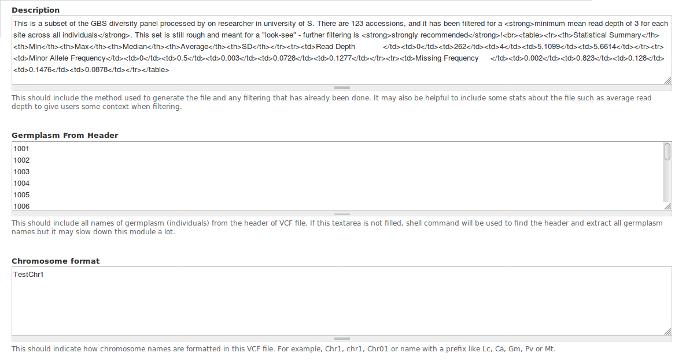

Optional information for Adding a file
======================================

The module can work without optional configuration, but it is highly recommended to provide it for better user experience. Instructions are provided for each configuration option.

The following screenshot is an example:

Description
-----------
What we could include in description:
  - Backgroud information about project/experiment and researchers/institution could help for better understanding of the file
  - Bioinformatic tools and correlated parameters that have been applied in generating the VCF file
  - Number of germplasm (individuals) included in the file, and names for maternal parent and paternal parent
  - A filter criteria related statistic summary (the summary in example can be generated by a `PHP script <https://gist.github.com/Jiu9Shen/1709484e7bf9564a27de6f2c221314b5>`_)

Germplasm From Header
---------------------
The names of all germplasm (individuals) in this vcf file. The germplasm list must be new line separated without any header or empty lines.

.. note::
  If this textarea is not filled, the module is able to find the list from selected VCF files. However, waiting time of extracting germplasm list from a selected file can be sifnificant for large VCF files.
  ``Loading time for a 10G VCF file will be about 3 seconds.``

  Since the germplasm list can be generated, it's not necessary to generate such a list for configuration otherwise. We can leave this section blank, select this file and copy generated list back to configuration.

Chromosome format
-----------------
  - Chromosome name can have various format, for example, chromosome 1 for one lentil cultivar could be chr1, Chr1, CHR1, LcChr1, Lcchr, and so on. Therefore, it is important to provide this information so users can filter vcf file by regions properly.
