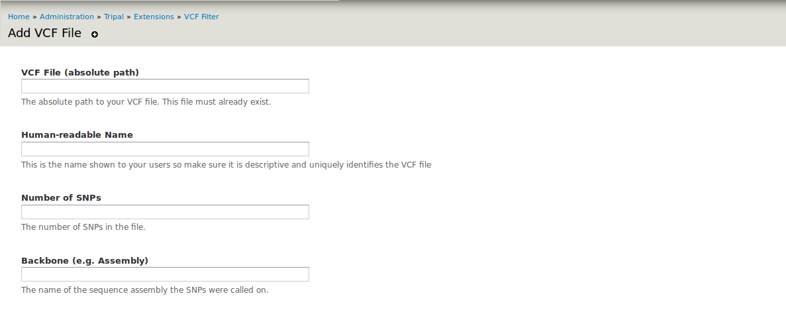

Required information for Adding a file
======================================

Only site admins can configure VCF Filter in Home » Administration » Tripal » Extensions » VCF Filter. The following information is required for adding a VCF file:
  - Absolute path of the file
  - Human-readable Name
  - Number of SNPs (sites) of the file
  - Backbone

