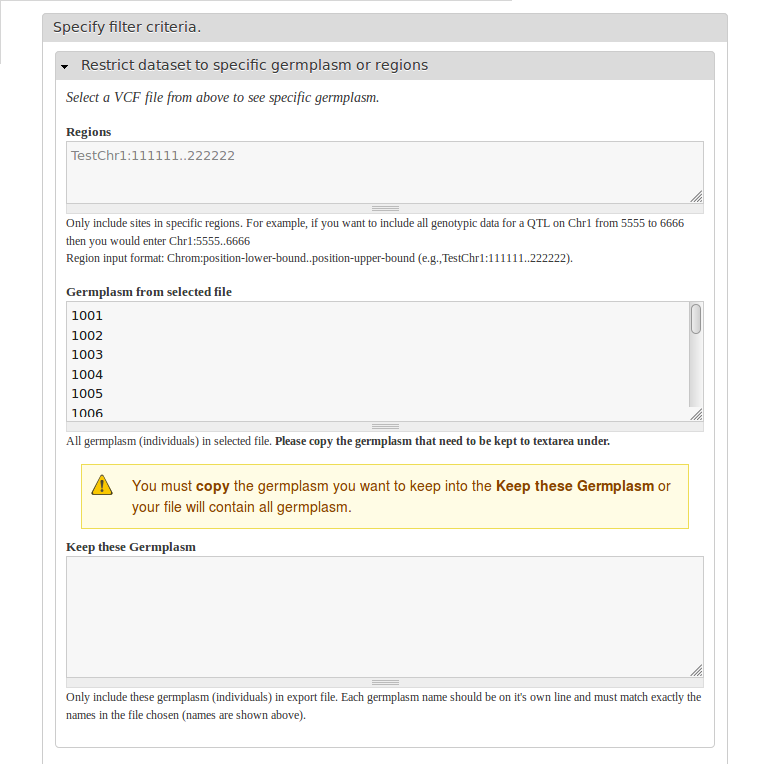
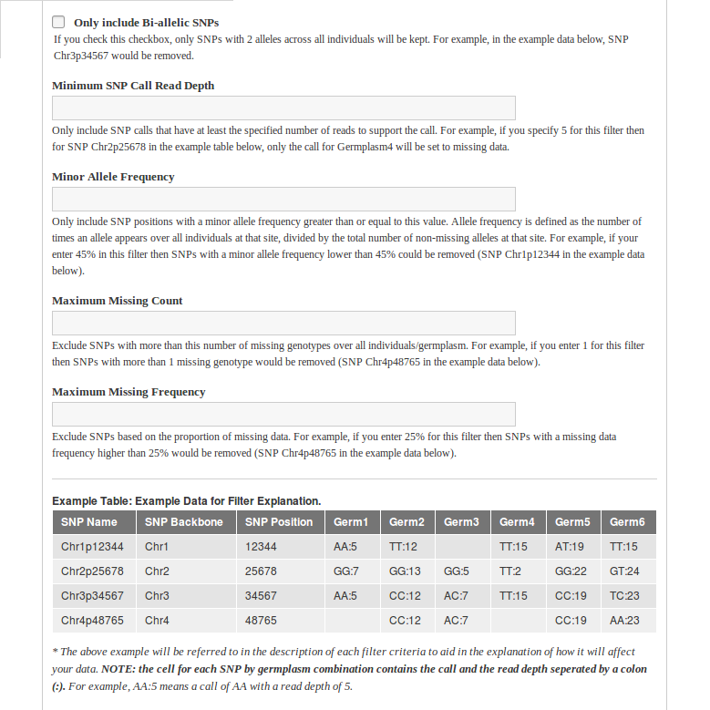

Various Filter Options
======================
Many filter options are available in this module. Each filter option is well documented with description, example, or even warning as users may not familiar with all filter options.

Restrict dataset to specific germplasm or regions
-------------------------------------------------
  - This section will be collasped if no file is selected.
  - Germplasm names from the file are provided to the user, who can then make changes and copy those they want to the textarea below.
  - Users can follow the example format provided to keep only sites in one specific region or multiple regions.
  - Help information can be configured to improve user experience.

Basic Filtering Options
-----------------------
Basic filter options include:
  - Bi-allelic
  - Read Depth
  - Minor Allele Frequency
  - Site Missing Count
  - Site Missing Frequency

.. note::

  Filter of CVF files is achieved by using bioinoformatic tool `VCFtools <https://vcftools.github.io/index.html>`_.
