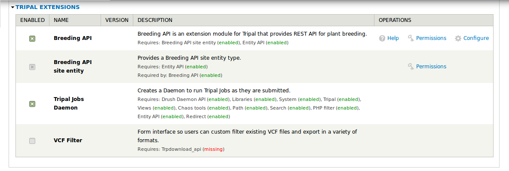
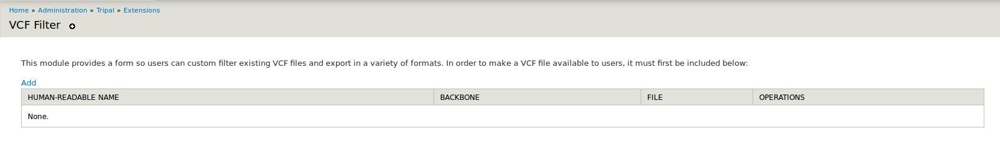

Installation
============

.. note::

  It is recommended to clear cashes regularly in this installation processes.

Download VCF Filter
-------------------

The module is availabe as one repository for `Pulse Bioinformatics, University of Saskatchewan <https://github.com/UofS-Pulse-Binfo>`_ on GitHub. Recommended method of downloading and installation is using git:

.. code:: bash

  cd [your drupal root]/sites/all/modules

  git clone https://github.com/UofS-Pulse-Binfo/vcf_filter.git

Dependencies
------------

Required dependencies for VCF Filter
  - Tripal Core (utilizes the Tripal API)
  - Tripal Donwload API

We can check status of modules in "Home » Administration » Tripal » Modules".

In this example, it is clear that Trpdownload_api is required but not available in system. `Trpdownload_api <https://github.com/tripal/trpdownload_api>`_ is availabe on GitHub, and can be installed with following commands:

.. code:: bash

  cd [your drupal root]/sites/all/modules

  git clone https://github.com/tripal/trpdownload_api.git

  drush pm-enable trpdownload_api

.. note::

  `VCFtools <http://vcftools.sourceforge.net/>`_ is required for VCF Filter.

Enable VCF Filter
-----------------
After all dependencies are installed and enabled, VCF Filter can be enabled to use in "Home » Administration » Tripal » Modules" of your site.

Also, VCF Filter can be enabled by drush command:

.. code:: bash

    drush pm-enable vcf_filter

This command will enable the module after which we should able to find it in Home » Administration » Tripal » Extensions.

